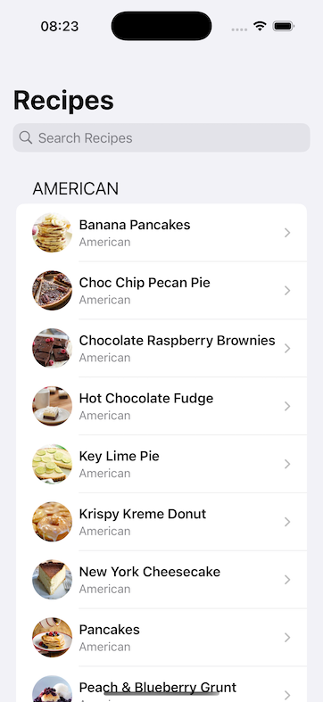
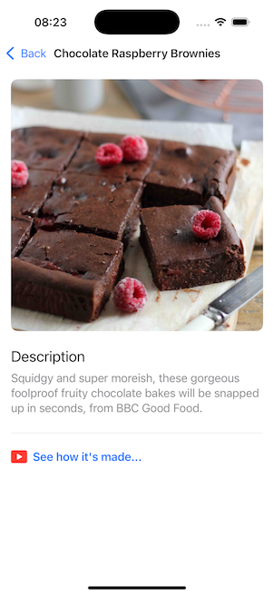
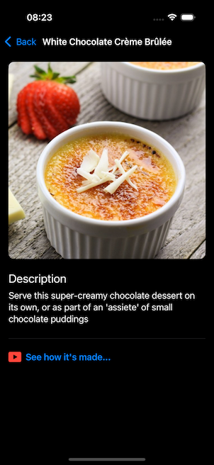
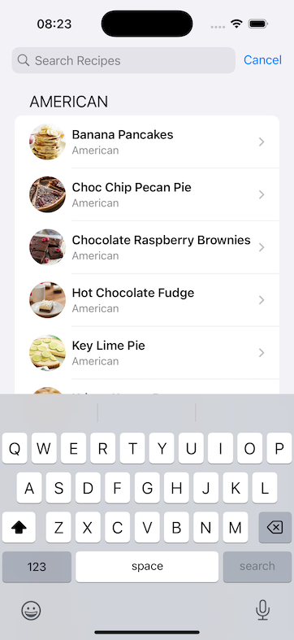
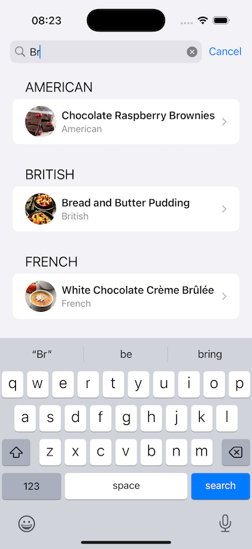
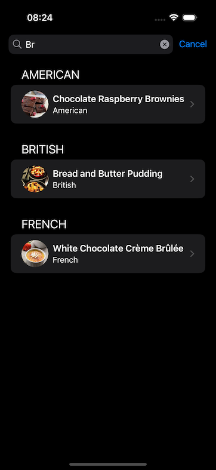
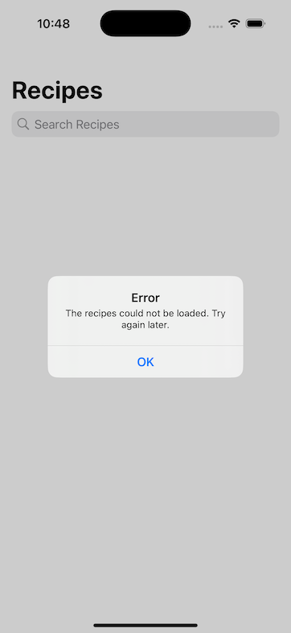

# Sous

## Overview

_'Sous' is an interactive recipe app that allows customers to find recipes from various sources. Sous fetches recipes from a provided API endpoint, displaying details such as the recipe name, photo, cuisine type, and a description._

### Features

#### Customer Interface/Experience

- Provides search functionality to find recipes.
- Groups recipes by cuisine type.
- Uses a responsive design, providing a rich experience for customers as they navigate through recipes.
- Customers can refresh the list of recipes at any time.
- Dark mode support for visibility for customers who know that dark mode is the best.

#### Technical Features

- Uses async/await for asynchronous operations, including API calls and image loading.
  - Loads images only when needed in the UI to minimize bandwidth consumption.
  - Implements a custom caching mechanism to cache images to disk, reducing repeated network requests.
- Uses SwiftUI for the customer interface, ensuring a modern and responsive design.
- No external dependencies, relying solely on Apple's frameworks for UI, networking, image caching, and testing.
- Implements unit tests to demonstrate the approach to testing.

#### Development Environment 

- Built on XCode Version 16.3 for iPhone 16 Pro (simulator).

### Recipes

### Recipe Details

### Recipe Search

### Error Handling

## Impact Prioritization/Focus Areas 

- I prioritized building an app that provides a seamless and delightful customer experience. A positive customer experience is crucial for any product, and my goals is to ensure the implementation empowers customers to find information about recipes.
- I accomplished this by focusing on:
    - __Customer Interface/Experience:__ I wanted to create a customer-friendly interface that is navigable and visually appealing.
    - __Performance:__ I ensured the app is responsive and performs well, even with a large number of recipes.

## Project Management

- Total time: 20 hours.
  - Project Setup and Planning (incl. setting up XCode, MacOS): 5 hours
  - Networking and Data Fetching: 5 hours
  - Custom Caching Implementation: 3 hours
  - UI Development (SwiftUI): 3 hours
  - Unit Testing: 1 hours
  - Refinement and Documentation: 3 hours

## Trade-offs and Decisions

- I opted to avoid caching the recipe description to keep the implementation simple and focused on the core requirements. Given that it was a self-imposed feature that I was interested in and not a core component, I decided to prioritize the core functionality of the app. There is also a variety of website layouts so more time would be required to contrive a more robust solution (compared to my simplified regex implementation) for fetching recipe description data.
- To improve the stability of the app, I spent additional effort to address race conditions in the cache implementation.
- To make efficient use of time, I prioritized working on customer features over a comprehensive testing suite.

## Areas for Improvement

- A weak part of this project is the testing suite. While I did implement unit tests for the custom caching implementation, I did not have time to write comprehensive tests for all components of the app. The focus was on customer delivery and ensuring the core functionality worked correctly, but additional testing would be beneficial for a production-ready application.
- Apart from testing, I believe there is room for improvement in the caching implementation. It works well for basic use cases, but will need further enhancements to scale for larger sets of information.

